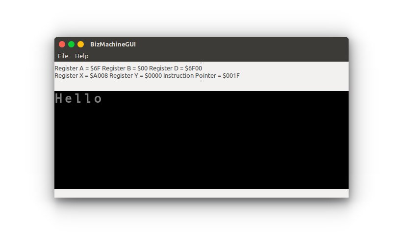

# bizasm

 [][paypal-donations] [](https://github.com/IonicaBizau/ama) [](https://www.npmjs.com/package/bizasm) [](https://www.npmjs.com/package/bizasm) [](https://www.codementor.io/johnnyb?utm_source=github&utm_medium=button&utm_term=johnnyb&utm_campaign=github)

> My first assembler and interpreter applications.

## Example
```asm
# Output "Hello" in console
HELLO_WORLD:

 LDA #72
 LDX #$A000
 STA ,X

 LDA #101
 LDX #$A002
 STA ,X

 LDA #108
 LDX #$A004
 STA ,X

 LDA #108
 LDX #$A006
 STA ,X

 LDA #111
 LDX #$A008
 STA ,X

 END HELLO_WORLD
```

After assembling the code above, when running it, the following result will appear:



## Assembler

Converts the assembly code in byte-code.

```sh
$ ./Assembler/Assembler/bin/Debug/Assembler.exe input-file.asm output-file.biz
```
## Interpreter

Interprets the byte-code and shows the result in the console.

```sh
$ ./BizMachineGUI/BizMachineGUI/bin/Debug/BizMachineGUI.exe output-file.biz
```

## :yum: How to contribute
Have an idea? Found a bug? See [how to contribute][contributing].


## :scroll: License

[MIT][license] © [Ionică Bizău][website]

[paypal-donations]: https://www.paypal.com/cgi-bin/webscr?cmd=_s-xclick&hosted_button_id=RVXDDLKKLQRJW
[donate-now]: http://i.imgur.com/6cMbHOC.png

[license]: http://showalicense.com/?fullname=Ionic%C4%83%20Biz%C4%83u%20%3Cbizauionica%40gmail.com%3E%20(http%3A%2F%2Fionicabizau.net)&year=2014#license-mit
[website]: http://ionicabizau.net
[contributing]: /CONTRIBUTING.md
[docs]: /DOCUMENTATION.md
